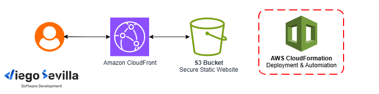
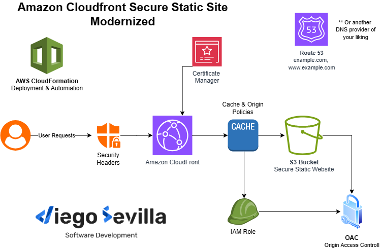

<h1 align="center">
<br>
  
<br>
<br>
CloudFront Secure Static Site Modernized
</h1>
<h2 align="center" >Version 2026</h2>

<hr />

A modernized CloudFormation-based template for deploying a secure static website on AWS with **Amazon S3**, **Amazon CloudFront**, **AWS Certificate Manager (ACM)**, and **Amazon Route 53**.

This project was started from the public `aws-samples/amazon-cloudfront-secure-static-site` template series and was updated to move away from the older **v0.5** implementation towards the newer **v0.12** style architecture and practices.

> **The goal of this repo is simple**: make the solution easier to deploy today, align it with more current CloudFront/S3 patterns, and keep the infrastructure explicit and customizable.

# Table of contents

<p align="center">
    
<p>

0.  [Prerequisites](#prerequisites)
1.  [What This Project Deploys?](#what-this-project-deploys)
2.  [Purpose of The Project](#purpose-of-the-project)
3.  [Modernization Summary](#modernization-summary)
4.  [Key Differences From Upstream v0.5](#key-differences-from-upstream-v05)
5.  [Repository Structure](#repository-structure)
6.  [Deployment Notes](#deployment-notes)
7.  [Who This Repo Is For](#who-this-repo-is-for)
8.  [Provenance Note](#provenance-note)
9.  [Useful Resources](#useful-resources)
10. [License](#license)


# Prerequisites

1. You need a registered domain name, such as `customdomain.com`, and point it to a **Route 53 hosted zone** in the same AWS account in which you deploy this solution. See [Configuring Amazon Route 53](https://docs.aws.amazon.com/Route53/latest/DeveloperGuide/dns-configuring.html) as your DNS service to learn more
2. You need the **AWS CLI** installed on your machine. Check [AWS CLI Docs](https://docs.aws.amazon.com/cli/latest/userguide/cli-chap-getting-started.html) to learn more.

# What this project deploys?

- An **S3 bucket** for static website assets
- An **S3 bucket** for access **logs**
- An **ACM certificate** for the domain
- A **CloudFront distribution** in front of the **S3 origin**
- **Route 53** alias records for the subdomain and, optionally, the apex domain
- A custom resource that uploads the `sample/static` assets to the origin bucket
- **CloudFront security headers**, **cache policy**, and **origin request policy**

# Purpose of the project

The original upstream project is useful, but the older **v0.5** implementation used patterns that are now _outdated_ for a fresh deployment, including:

- **Origin Access Identity (OAI)** instead of **Origin Access Control (OAC)**
- **Node.js 12** for the copy helper Lambda and Lambda layer
- a **Lambda@Edge** function for response security headers
- broader IAM access for the asset-copy function

This repo modernizes that approach by adopting the direction later visible in the upstream **v0.12** pre-release and then adding some extra improvements for real-world use.

---

# Modernization summary

- Replacing **OAI** with Origin Access Control (OAC) for secure S3 access
- Upgrading helper functions to **Node.js 20**
- Using CloudFront Response Headers Policies instead of Lambda@Edge
- Applying least-privilege IAM for S3 operations
- Keeping the **S3 origin** private behind **CloudFront**
- Adding improved **logging**, encryption, and ownership controls
- Supporting optional apex domains (`example.com` + www)
- Introducing explicit resource naming parameters
- Defining custom cache and origin request policies
- Enabling **SPA-friendly** error handling (403/404 → 200)

See the full details in [Modernization Summary Detals](./RM_MODERNIZATION_SUMMARY.md)

---

# Key Differences From Upstream v0.5

Compared with the older v0.5 version of the AWS sample, this repo makes the following major changes:

- replaces **OAI** with **OAC**
- replaces **Node.js 12** with **Node.js 20** for the copy helper
- removes the **Lambda@Edge** response-header function in favor of **CloudFront ResponseHeadersPolicy**
- tightens S3 IAM permissions for the copy helper role
- adds optional **apex record** support
- adds explicit **resource naming parameters**
- adds custom **CachePolicy** and **OriginRequestPolicy**
- customizes **security headers**, especially the CSP
- changes `403` and `404` behavior for frontend-friendly routing
- keeps the S3 origin private and CloudFront-only

---

# How This Relates To Upstream v0.12

This repo follows the same overall modernization path visible in the upstream **v0.12 pre-release**, especially in these areas:

- **OAC** instead of **OAI**
- **Node.js 20** for the copy helper runtime
- **ResponseHeadersPolicy** instead of Lambda@Edge for response security headers
- more scoped IAM for the S3 copy function
- optional apex-domain support

On top of that, this repo adds its own opinionated improvements, including:

- **named resources** through parameters
- **custom cache/origin** request policies
- a richer CSP for frontend integrations
- configurable fallback pages for `403` and `404`
- practical deployment defaults for a real static site/frontend setup

---

# Repository Structure

```text
templates/
  main.yaml               # root stack
  acm-certificate.yaml    # ACM certificate and validation setup
  custom-resource.yaml    # S3 buckets + copy helper resources
  cloudfront-site.yaml    # CloudFront, Route 53, security headers, policies
assets/                   # diagrams for better illustration of deployment
config/                   # example parameter files
source/
  witch.js                # AWS Lambda function used during deployment to upload the static website assets to Amazon S3
www/                      # static site content copied to the S3 origin
scripts/                  # other useful scripts
  upload-to-s3.js         # can be used to read your dist/ directory generated by Vite/React and upload its contents to your s3 bucket
```

---

# Deployment Notes

This template is intended for deployment in **us-east-1**, which is required for ACM certificates used with CloudFront.

High-level flow:

1. Package the SAM/CloudFormation artifacts
2. Upload packaged artifacts to an S3 artifact bucket
3. Deploy the stack with your domain parameters
4. Wait for the nested stacks to complete
5. Point traffic to the CloudFront-backed domain records created by Route 53

See more details about each step in [Deployment](./RM_DEPLOYMENT.md)

---

# Who This Repo Is For

This project is useful if you want:

- a secure static website on AWS
- a CloudFormation-based starting point instead of clicking through the console
- a template that reflects more current CloudFront/S3 practices than the older v0.5 sample
- a good learning reference for CloudFront, S3, ACM, Route 53, and infrastructure design decisions

---

# Provenance Note

This project was inspired by and originally derived from the public AWS sample:

- [aws-samples/amazon-cloudfront-secure-static-site](https://github.com/aws-samples/amazon-cloudfront-secure-static-site)

This repo is intended as a modernization and customization of that template, especially to bridge the gap between the older **v0.5** implementation and the newer architectural direction visible in the **v0.12** pre-release.

---

# Useful Resources

- [AWS CLI Getting Started](https://docs.aws.amazon.com/cli/latest/userguide/cli-chap-configure.html)

- [AWS cloudformation reference guide](https://docs.aws.amazon.com/AWSCloudFormation/latest/UserGuide/template-guide.html)

- [Using parameter override functions with CodePipeline pipelines](https://docs.aws.amazon.com/AWSCloudFormation/latest/UserGuide/continuous-delivery-codepipeline-parameter-override-functions.html)

- [AWS CLI DEPLOY](https://docs.aws.amazon.com/cli/latest/reference/cloudformation/deploy.html#deploy)
  - [AWS CLI DEPLOY - Override Params](https://docs.aws.amazon.com/cli/latest/reference/cloudformation/deploy.html#examples)

## Yaml

- [AWS::CloudFront::Distribution DistributionConfig](https://docs.aws.amazon.com/AWSCloudFormation/latest/TemplateReference/aws-properties-cloudfront-distribution-distributionconfig.html)
- [CloudFormation template Conditions syntax](https://docs.aws.amazon.com/AWSCloudFormation/latest/UserGuide/conditions-section-structure.html)

# License

This project includes code from AWS samples licensed under the Apache License 2.0.

- Original components: Apache License 2.0
- Modifications in this repository: MIT License

See LICENSE, LICENSE-APACHE, and NOTICE for details.